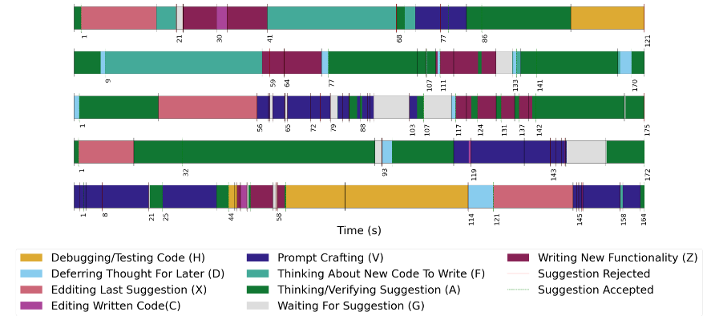
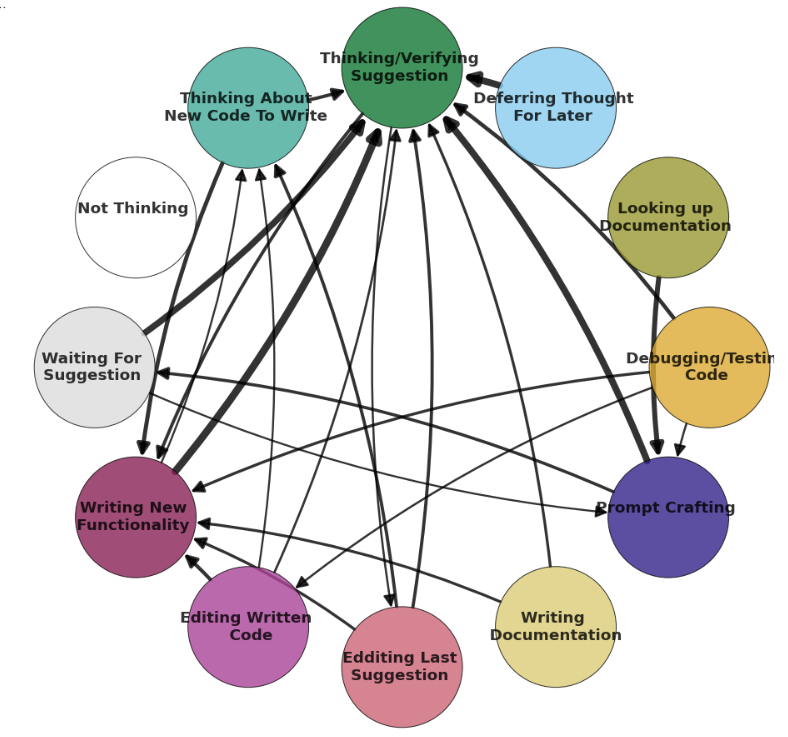
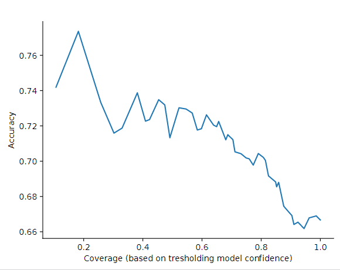

# Code and Data for: Reading Between the Lines: Modeling User Behavior and Costs in AI-Assisted Programming

Arxiv link: https://arxiv.org/abs/2210.14306

*Data will be released soon, be on the lookout*

# Installation

The environment named 'coderec' is available as a yml file and can be installed using:
```
conda env create -f environment.yml
```

Some of the packages are not required for all the scrips and notebooks, but are included in the environment for convenience. 

There is also a requirements.txt file available, but it does not include pip install so it is insufficient, to use that:
```
conda create --name coderec --file requirements.txt
```
We will also need to install further libraries and tools.

- Treesitter for getting code labels
```
 git clone https://github.com/tree-sitter/tree-sitter-python
```


# Dataframe for user study

Our study complete data is stored in '/data/logs_by_user_session_labeled.pkl' which contains python  array which we will name 'df_observations' where: 'df_observations[i]' is the session for the ith user stored as a pandas dataframe.

To be more explicit, df_observations[i] is a pandas dataframe that contains the following columns:
```
'UserId' 
'TimeGenerated': timestamp for event
'StateName': betweeen 'Shown', 'Accepted', 'Rejected', 'Replay' (consecutive shown), 'Browsing' (shown different choice index)
'HiddenState' : high level hidden state between 'UserBeforeAction', 'UserPaused', 'UserTyping'
'TimeSpentInState'
'CurrentSuggestion' 
'CurrentPrompt'
'Measurements': measurements from the non-restricted logs raw
'EditPercentage': an array containing the relative edit distance (in 0-1) for the 5 stillincode events for this completion
'LabeledState': the state label by the user for the current state
```

The LabeledState takes the following values:
```
Thinking About Suggestion (a): actively thinking/verifying about suggestion shown, also includes going to the internet to verify <br>
Not Thinking (s): not thinking about suggestion shown  <br>
Deferring Thought For Later (d): decide to not think now about suggestion, but will think later about it  <br>
Thinking About New Code To Write (f): thinking about code outside suggestions to write, new functionality  <br>
Waiting For Suggestion (g): waiting for Copilot suggestion to be shown   <br>
Writing New Code (z): writing code that implements new functionality <br>
Editing Recent Suggestions (x): editing recent Copilot suggestions<br>
Editing (Personally) Written Code(c): editing code you wrote that was not a Copilot suggestion for purpose of fixing functionality <br>
Prompt Crafting (v): writing comment or code with intention of copilot completion<br>
Writing Documentation (b): adding comments for purpose of documentation,<br>
Debugging/Testing Code (h): running or debugging code to check functionality, may include writing tests or debugging statements<br>
Looking at documentation: looking online for documentation
```

The study dataframe is also stored as a csv file in '/data/logs_by_user_session_labeled.csv' which can be imported as a single pandas dataframe. 


# User Interface for Study Data

You can interact with the study data using our annotation interface.

Steps:

- First make sure to download the data including the labels (.json files) and the videos (.mp4 files). 
- Place both the json and mp4 in the 'user_study_webapp/app_study/static' folder.
- For each study,  run the following commands:

```
python server.py -p static/logs_user_extended_8.json -v static/video_cropped_8.mp4
```
- Go to http://localhost:8080/ on your browser to see the interface.


We include the instructions for each coding task in [coding_tasks](user_study_webapp/coding_tasks.ipynb)


# Visualization and Analysis for User Study

## Drawing Timelines and Graphs


Use the jupyter notebook [viz_draw](user_study_analysis/viz_draw.ipynb) to draw the timelines for the study data.




Use the jupyter notebook [viz_draw](user_study_analysis/viz_draw.ipynb) to draw the graph for the study data.





##  Analysis

For insights and analysis that are found in our paper, they can be replicated in the following two notebooks:

- [high level statistics about actions, states and transitions](user_study_analysis/high_level_stats.ipynb.ipynb)
- [time adjustments and deeper insights](user_study_analysis/deep_insights.ipynb.ipynb)


# Generating Features from the  Dataframe for Prediction and Decoding


Given the extended logs, we will generate features for the prediction and decoding models.

The below command will generate a pickle file containing a python variable, name it 'df_features', of the following form:

df_features[i][j][h]: is the h'th feature for the k'th event for the ith user.

Let us elaborate further, df_features[i] is the all the data for the ith user. df_features[i][k] contains the features for the k'th event in the  session. Finally, df_features[i][k][h] contains the h'th feature, more precisely, df_features[i][k] is a list of different feature, where df_features[i][k][h]  is a list contains a representation of the h'th feature as follows:
```
   feature_dict = {'Measurements: compCharLen, confidence, documentLength, numLines, numTokens, promptCharLen, promptEndPos, quantile': 0,
    'edit percentage': 1, 'time_in_state': 2, 'session_features':3, 'suggestion_label':4, 'prompt_label':5,
    'suggestion_embedding':6, 'prompt_embedding':7, 'suggestion_text_features':8, 'prompt_text_features':9, 'statename':10}
```
meaning df_features[i][k][0] is a list contaning all measurement features, i.e. compCharLen, confidence, documentLength, numLines, numTokens, promptCharLen, promptEndPos, quantile in a row. And then df_features[i][k][6] is the 768 dimensional suggestion embedding and so forth.


The command to get the features pickle file is:
```
python action_prediction/generate_features.py -p'OUTPUT_PATH_EXTENDED_LOGS.pkl' \
-c 0 \
-b 1000 \
-o 'OUTPUT_PATH_features.pkl' \
-e 1 \
-m 99999  \ 

```

the documentation for the args is:
```
('-p', '--path', help='Path to extended logs frame', required=True) 
('-c', '--cudadevice', help='cuda device id', default=0, required=True, type=int)
('-b', '--batchsize', help='batch size', default=1000, required=True, type=int)
('-o', '--output', help='Output path of .pkl file', required=True) 
('-e', '--embedding', help='Whether to get embeddings for suggestion and prompt', required=True, type=int)
('-m', '--maxusers', help='max users', default=100, required=True, type=int)

```

# Predicting Accepts and Rejects


The task of predicting Accepts and Rejects can be directly ran after generating the features.

The script we will run trains an XGBoost model on the features and predicts the Accepts and Rejects and generate multiple plots and pickle files that save the results and model. The plots contain multiple analysis of the results.

Note that we split data into train-val-split according to random_state=42, this can be changed in the action_prediction_prep.py script.

```
python action_prediction/action_prediction_xgb.py -p 'OUTPUT_PATH_features.pkl' \
-c 0 \
-s 1 \
-o 'OUTPUT_PATH_PLOTS_MODELS' \ 
-t 0.2 \ 
-v 0.1 \
```

The argument documentation is
```
('-p', '--path', help='Path to features array', required=True) # change to True
('-c', '--usegpu', help='to use gpu (1 or 0)', default=0, required=True, type=int)
('-s', '--splitbyusers', help='split by users or session (0 or 1)', default=0, required=True, type=int)
('-o', '--output', help='output path folder to store results',  required=True)
('-t', '--testpercentage', help='test percentage', default = 0.2, type =float)
('-v', '--valpercentage', help='val percentage', default =0.1, type=float)
```

Note that there are other parameters we can change in the code to improve performance! You should expect to get almost 0.7 AUC and 70% accuracy on the test set. Note these numbers are not the same as those in Section 6 of the paper as those where obtained on a different dataset.





# Citation

Please cite our paper if you use our dataset or code:

```
@article{mozannar2022reading,
  title={Reading Between the Lines: Modeling User Behavior and Costs in AI-Assisted Programming},
  author={Mozannar, Hussein and Bansal, Gagan and Fourney, Adam and Horvitz, Eric},
  journal={arXiv preprint arXiv:2210.14306},
  year={2022}
}

```

# Other

## Acknowledgements
This release is part of research done during an internship at Microsoft Research ([privacy statement](https://privacy.microsoft.com/en-us/privacystatement)) and was based on valuable feedback from colleagues across MSR and GitHub including Saleema Amershi, Victor Dibia, Forough Poursabzi, Andrew Rice, Eirini Kalliamvakou, and Edward Aftandilian.


## Contributing

This project welcomes contributions and suggestions.  Most contributions require you to agree to a
Contributor License Agreement (CLA) declaring that you have the right to, and actually do, grant us
the rights to use your contribution. For details, visit https://cla.opensource.microsoft.com.

When you submit a pull request, a CLA bot will automatically determine whether you need to provide
a CLA and decorate the PR appropriately (e.g., status check, comment). Simply follow the instructions
provided by the bot. You will only need to do this once across all repos using our CLA.

This project has adopted the [Microsoft Open Source Code of Conduct](https://opensource.microsoft.com/codeofconduct/).
For more information see the [Code of Conduct FAQ](https://opensource.microsoft.com/codeofconduct/faq/) or
contact [opencode@microsoft.com](mailto:opencode@microsoft.com) with any additional questions or comments.

## Trademarks

This project may contain trademarks or logos for projects, products, or services. Authorized use of Microsoft 
trademarks or logos is subject to and must follow 
[Microsoft's Trademark & Brand Guidelines](https://www.microsoft.com/en-us/legal/intellectualproperty/trademarks/usage/general).
Use of Microsoft trademarks or logos in modified versions of this project must not cause confusion or imply Microsoft sponsorship.
Any use of third-party trademarks or logos are subject to those third-party's policies.
